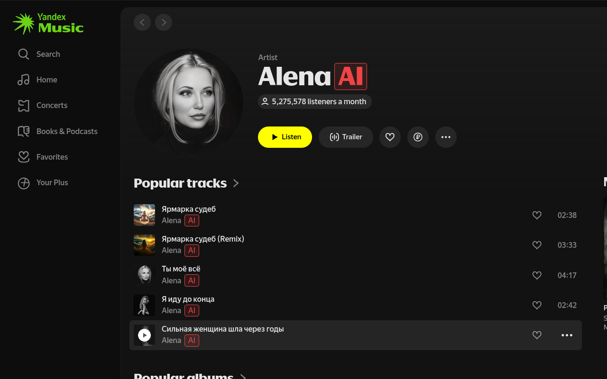

# Slopless

[](https://t.me/yet_another_dev) 

Keep your music free of AI slop.



## Installation

Install the browser extension for Yandex Music for free.

- [Chrome Web Store](https://chromewebstore.google.com/detail/slopless/ceehepkmdedlkcgcaocbfjheafkfnaej)
- [Firefox Add-ons](https://addons.mozilla.org/addon/slopless/)

## Development

### Prerequisites

- Operating system: Linux, macOS, or Windows
- [Node.js 24.x](https://nodejs.org/en/download)
- [pnpm 9.x](https://pnpm.io/installation#using-corepack)

Go to the `extension` directory and install dependencies:

```sh
cd extension
pnpm i
```

### Run locally

To run the add-on locally in development mode:

```sh
# Google Chrome
pnpm dev

# Firefox
pnpm dev:firefox
```

### Build from source

To build the add-on from source:

```sh
# Google Chrome
pnpm build

# Firefox
pnpm build:firefox
```

Or run zip scripts to get a ready-to-upload archive:

```sh
# Google Chrome
pnpm zip

# Firefox
pnpm zip:firefox
```

## Creating a release

1. Update `version` in [`extension/package.json`](./extension/package.json).

2. Create `data/v<version>.json.gz` with the new format
   and update `SOURCE_URL` in [`AiArtistsService.ts`](./extension/src/services/AiArtistsService.ts) if the JSON data format changed.

    The filename should match the extension version when the format was introduced (e.g. `v0.2.0.json.gz`). Overwrite the same file if only the data refreshes.

3. From the repository root, tag and push:

    ```sh
    git tag -a v* -m "Slopless v*"
    git push origin v*
    ```

    The [`release.yaml`](./.github/workflows/release.yaml) workflow runs necessary scripts automatically when a `v*` tag is
    published.
