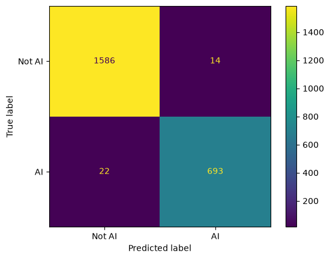
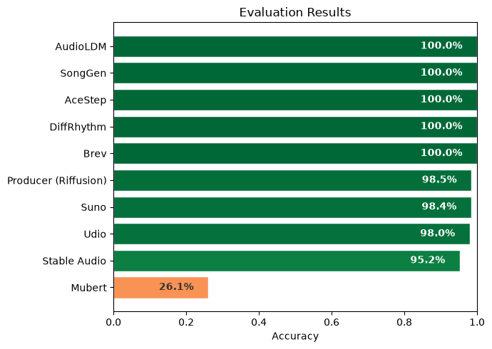

# AI music classifier

Trains an XGBoost classifier on two datasets:

1. AI music - [Echoes](https://huggingface.co/datasets/Octavian97/Echoes) (3,577 tracks, 10 generation providers)
2. Human music - [FMA small](https://github.com/mdeff/fma) (8,000 tracks, 8 balanced genres)

## Method

This notebook is inspired by the Deezer Research team's ISMIR 2025 paper ["A Fourier Explanation of AI-music Artifacts"](https://arxiv.org/abs/2506.19108) (Darius Afchar, Gabriel Meseguer-Brocal, Kamil Akesbi, Romain Hennequin). It uses a different feature extraction approach: the first derivative (forward difference) combined with principal component analysis instead of calculating lower-hull fakeprints.

## Requirements

- Python 3.13+
- [uv](https://docs.astral.sh/uv/)
- ~15 GB free disk space (6.2 GB Echoes + 7.2 GB FMA + features)

## Run

```bash
git clone https://github.com/alexeyfv/slopless
cd classifier
uv sync
```

Then open the notebook and press "Run All".

## Results

Overall accuracy: 98.44% on a balanced test set (1,600 real + 715 AI tracks).



The model detects most providers perfectly but struggles with Mubert (26%).


